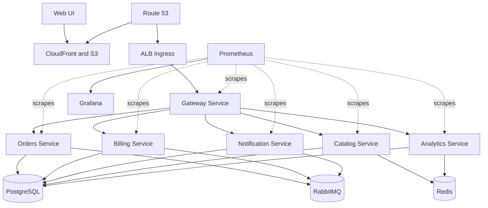

# System Map

## System Overview

AcmeCorp Platform is a teaching and demonstration repository for a modern Java microservice platform.

Use [codebase-overview.md](codebase-overview.md) for the fuller onboarding narrative, workflow sequence, and contract notes. This page stays focused on the short system map.

At a high level it combines:

- a React + Vite web UI
- a Spring Boot and Quarkus backend behind a gateway
- local Docker Compose workflows
- AWS infrastructure provisioned by Terraform
- Kubernetes deployment packaged by Helm
- Prometheus and Grafana observability
- branch-based benchmark and runtime experiments

## Deployment Scopes

| Scope | Runs Here | Notes |
| --- | --- | --- |
| local Compose | PostgreSQL, Redis, RabbitMQ, all backend services | main local runtime from `infra/local/docker-compose.yml` |
| local UI | Vite web UI | runs separately on `http://localhost:5173` |
| Kubernetes via Helm | application services, Redis, Prometheus, Grafana, External Secrets | canonical EKS packaging path |
| AWS-managed services | VPC, EKS, Aurora, Amazon MQ, ECR, ACM, Route53, S3, CloudFront | provisioned by Terraform |
| plain Kubernetes compatibility path | app and dependency manifests under `infra/k8s/base/` | demo/compatibility path, not the canonical AWS run path |

## Runtime Architecture

## Services And Responsibilities

| Service | Stack | Responsibility | Main Dependencies |
| --- | --- | --- | --- |
| `gateway-service` | Spring Boot WebFlux | browser-facing API entry point and downstream proxy | backend services |
| `orders-service` | Spring Boot | order lifecycle and benchmark hot path | PostgreSQL, billing, analytics, catalog, RabbitMQ |
| `catalog-service` | Quarkus | product catalog CRUD and cache-aware reads | PostgreSQL, Redis |
| `billing-service` | Spring Boot | billing and invoice-related workflows | PostgreSQL, analytics |
| `notification-service` | Spring Boot | notification delivery and retry / DLQ behavior | PostgreSQL, RabbitMQ |
| `analytics-service` | Spring Boot | counters and analytics aggregation | Redis; readiness also checks configured DB connectivity |

## Local Development Topology

The supported local runtime is `infra/local/docker-compose.yml`.

It starts:

- PostgreSQL
- RabbitMQ
- Redis
- all backend services

The UI runs separately through Vite on `http://localhost:5173` and calls the gateway on `http://localhost:8080`.

Local defaults:

| Component | Local Address |
| --- | --- |
| UI | `http://localhost:5173` |
| Gateway | `http://localhost:8080` |
| Orders | `http://localhost:8081` |
| Billing | `http://localhost:8082` |
| Notification | `http://localhost:8083` |
| Analytics | `http://localhost:8084` |
| Catalog | `http://localhost:8085` |
| RabbitMQ UI | `http://localhost:15672` |

Supporting local docs:

- [development/local-setup.md](development/local-setup.md)
- [../infra/local/README.md](../infra/local/README.md)

## AWS Deployment Topology

The canonical AWS path is:

1. Terraform provisions VPC, EKS, Aurora, Amazon MQ, Secrets Manager, IAM, ECR, ACM, Route53, and S3 + CloudFront UI hosting.
2. `scripts/render-prod-values.sh` uses Terraform outputs as the source of truth for the Terraform-to-Helm boundary contract and renders the deployment values file.
3. `helm/acmecorp-platform` deploys the application services, Redis, Prometheus, Grafana, and External Secrets.
4. The UI is built separately and published to the Terraform-managed S3 + CloudFront path.

Kubernetes namespace model in the canonical chart:

| Namespace | Main Contents |
| --- | --- |
| `acmecorp` | application services |
| `data` | Redis |
| `observability` | Prometheus and Grafana |
| `external-secrets` | External Secrets operator |

Supporting deployment docs:

- [deployment/terraform.md](deployment/terraform.md)
- [deployment/platform-deployment.md](deployment/platform-deployment.md)
- [deployment/ui-cloudfront.md](deployment/ui-cloudfront.md)

## Observability Topology

Observability is Prometheus-and-Grafana based.

- Spring services expose `/actuator/prometheus`
- the Quarkus catalog service exposes `/q/metrics`
- local observability uses `infra/local/docker-compose.observability.yml`
- Kubernetes observability is packaged through the canonical Helm chart and supported by assets in `infra/observability/`

Supporting docs:

- [operations/observability.md](operations/observability.md)
- [../infra/observability/README.md](../infra/observability/README.md)

## Branch Model

The repository uses long-lived maintained platform branches plus experiment branches.

Canonical branch model:

- [branch-model.md](branch-model.md)

Key point:

- branch comparisons are platform-branch comparisons unless the harness isolates only the JVM

## Benchmarking

Benchmarking compares the runnable platform through the existing harness in `bench/`.

Canonical benchmark docs:

- [benchmarking.md](benchmarking.md)
- [../bench/README.md](../bench/README.md)

Key point:

- `java21` versus `java25` results are not universal JVM claims by default

Benchmark tooling entry points:

- `bench/run-once.sh`
- `bench/run-matrix.sh`
- `bench/run-java21-vs-java25.sh`
- `bench/run-episode07-refresh.sh`

## Infrastructure Ownership Map

| Area | Owns | Canonical Doc |
| --- | --- | --- |
| `infra/local` | local Compose runtime and local observability overlay | [../infra/local/README.md](../infra/local/README.md) |
| `infra/terraform` | AWS foundation and outputs | [../infra/terraform/README.md](../infra/terraform/README.md) |
| `helm/acmecorp-platform` | canonical Kubernetes packaging for AWS/EKS | [../helm/acmecorp-platform/README.md](../helm/acmecorp-platform/README.md) |
| `infra/observability` | dashboards and ServiceMonitor assets | [../infra/observability/README.md](../infra/observability/README.md) |
| `infra/k8s` | plain Kubernetes compatibility manifests | [../infra/k8s/README.md](../infra/k8s/README.md) |
| `scripts` | operational helper scripts | [../scripts/README.md](../scripts/README.md) |
| `bench` | benchmark tooling and result layout | [../bench/README.md](../bench/README.md) |

## Where To Find Canonical Docs

| Topic | Canonical Doc |
| --- | --- |
| Documentation hub | [README.md](README.md) |
| System map | [system-map.md](system-map.md) |
| Branch model | [branch-model.md](branch-model.md) |
| Benchmarking | [benchmarking.md](benchmarking.md) |
| Optimization branches | [optimizations/README.md](optimizations/README.md) |
| Local development | [development/local-setup.md](development/local-setup.md) |
| AWS deployment | [deployment/platform-deployment.md](deployment/platform-deployment.md) |
| Terraform | [deployment/terraform.md](deployment/terraform.md) |
| Observability | [operations/observability.md](operations/observability.md) |
| Configuration reference | [reference/configuration.md](reference/configuration.md) |
